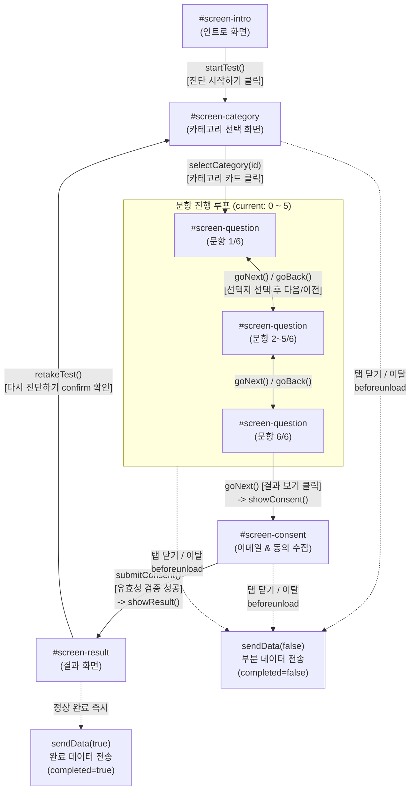

# ANALYSIS-01: 서비스 개요 및 사용자 플로우 분석

> **분석 대상 파일**: `index.html` (2,646줄), `quiz-data.js` (716줄)  
> **외부 참조 자료**: `meeting-1.txt`, `meeting-2.txt`, `HANDOFF.md` (미니맥스 작업 폴더)  
> **작성일**: 2026-08-30  
> **작성자**: Antigravity  

---

## 1. 서비스 정체 및 비즈니스 목적

### 1.1 비즈니스 배경과 정체성
본 서비스는 **벨라리치㈜(대표 김자영)** 가 운영하는 **"중소기업 CEO 및 자산가 전용 법인 자산 1분 건강검진"** 온라인 진단 도구(`index.html:6, 12, 21`)입니다.

* **핵심 가치 제안 (3-in-1 Fusion Model)**:
  * 부동산 전문가(현장 경력 20년+) + 법인 전문가(컨설팅 노하우 7~10년) + 국제공인재무설계사(CFP®) 및 공인중개사의 **3개 영역 융합 모델**을 제시합니다 (`index.html:1443-1454, 1463-1488, 1519-1548`).
  * "세무사는 부동산을 모르고, 부동산 중개사는 법인 세무를 모른다"는 시장의 단절을 파고들어, 법인 부동산·사옥·절세·가업승계·은퇴자산 설계를 원스톱으로 해결해 주는 유일한 통합 파트너로 포지셔닝합니다 (`index.html:1463-1465, 1515-1517`, `meeting-2.txt:53-56`).

### 1.2 핵심 비즈니스 목적
1. **리드 마그넷(Lead Magnet) 역할**:
   * 오프라인 세미나·강의·CEO 모임 직후 QR 코드로 진입하거나(`meeting-2.txt:33-35`), 블로그·유튜브·SNS(`index.html:1690-1695, 1888-1911`)를 통해 유입된 잠재 고객(중소기업 대표)에게 **1분 무료 진단**이라는 진입 장벽이 낮은 경험을 제공합니다.
2. **고품질 B2B 리드(이메일 DB) 확보**:
   * 진단 결과를 상세하게 받아보려면 이메일을 입력해야 하는 구조(`index.html:1763-1795`)를 통해 실명 법인 대표의 연락 가능한 이메일 및 관심 카테고리/자산규모 DB를 획득합니다.
3. **무료 1:1 방문/화상 컨설팅으로의 전환 (Conversion)**:
   * 진단 결과 화면과 발송 이메일을 통해 "숨은 리스크/기회"를 자극하고, 최종적으로 **30분 무료 1:1 전략 진단(상담 신청)** 으로 연결합니다 (`index.html:1836-1848, 2409-2423`).

---

## 2. 타깃 사용자 및 심리적 전환 여정

### 2.1 타깃 사용자 프로필
* **주요 타깃**: 40~60대 비상장 중소기업 CEO, 임대사업자, 법인 부동산 보유 자산가 (`meeting-1.txt:127-130`, `meeting-2.txt:71-78, 111`).
* **고객의 주요 페인 포인트**:
  * 개인 명의 부동산의 법인 전환 및 상속세 부담(최고 50%) 우려.
  * 법인 잉여금 누적 및 종합소득세율(최고 49.5%) 누수.
  * 사옥 마련, 공실 해소, 가업상속공제 및 2세 지분 승계의 복합적 난제.

### 2.2 심리적 전환 여정 (Conversion Funnel)

```
[1. 인지 & 흥미] ──> [2. 저항감 해소] ──> [3. 관심 영역 선택] ──> [4. 자가 진단 몰입] ──> [5. 가치 교환(리드)] ──> [6. 행동 유도(CTA)]
  "내 법인 자산        "1분 소요,          5개 카테고리 중        6문항 응답하며          "상세 분석은           "30분 무료
   어디까지 최적화?"     100% 익명"          가장 큰 고민 선택       잠재 리스크 자각         이메일로 발송"         1:1 상담 신청"
```

1. **인지 및 호기심 자극 (Hero Section)**:
   * `"내 법인 자산, 지금 어디까지 최적화되어 있나요?"`라는 질문으로 현상 유지에 대한 불안감과 호기심을 유발 (`index.html:1438`).
2. **진입 장벽 및 심리적 저항감 최소화 (Intro Section)**:
   * `"10개 질문 · 1분"`, `"100% 익명"`, `"결과 즉시 확인"`을 강조하여 개인정보 유출 우려를 불식 (`index.html:1614-1629, 1660, 1682`).
   * "데이터 수집 거부하고 시작" 버튼(`index.html:1681`)을 병기하여 거부감 제로화.
3. **선택적 사전 정보 수집 (Q0 Section)**:
   * 자산 규모 범위(5억 미만 ~ 100억 이상)를 선택하도록 하여 맞춤 진단에 대한 기대감을 부여 (`index.html:1633-1644`).
4. **관심 집중 (Category Screen)**:
   * 5개 카테고리(세액감면, 부동산, 가업승계, 은퇴, 경영) 중 자신이 당면한 가장 절박한 주제를 1개 선택 (`index.html:1714-1716, 2185-2200`).
5. **문제 자각 및 몰입 (Question Screen)**:
   * 6개의 4지선다 문항에 답하면서 현재 본인 회사의 절세·승계·부동산 준비가 미흡함을 스스로 인식 (`index.html:1725-1746, 2224-2259`).
6. **가치 교환 및 리드 획득 (Consent Screen)**:
   * 진단 직후 "자세한 등급, 핵심 포인트, 다음 단계 가이드는 이메일로 보내드린다"며 이메일 입력을 요구 (`index.html:1763-1766`). 이미 6문항을 완료한 사용자는 매몰 비용 심리로 인해 이메일을 기꺼이 입력.
7. **결과 확인 및 상담 전환 (Result Screen)**:
   * 잠재 기회 지수(점수)와 등급(S/A/B/C)을 확인하고, "숨은 기회 점검" / "긴급 진단" CTA를 통해 1:1 상담 신청 메일을 발송하도록 유도 (`index.html:1804-1848, 2409-2423`).

---

## 3. 화면 플로우 및 상태 전이 상세 분석

### 3.1 5대 스크린 구성 및 식별자

| 화면 ID | 화면 명칭 | 렌더링 방식 및 주요 구성 |
|---|---|---|
| `#screen-intro` | 인트로 (랜딩) | 정적 HTML. Hero, 3-in-1 다이어그램, 김자영 대표 프로필, 서비스 목록, 데이터 수집 안내, **Q0 자산규모**, 진단 시작 버튼 (`index.html:1428-1698`) |
| `#screen-category` | 카테고리 선택 | 동적 렌더링(`renderCategoryScreen`). 5개 카테고리 카드 그리드 (`index.html:1701-1722, 2181-2201`) |
| `#screen-question` | 문항 진행 (Q1~Q6) | 동적 렌더링(`renderQuestion`). 프로그레스 바, 질문 태그, 질문 텍스트, 4지선다 라디오 버튼, 이전/다음 네비게이션 (`index.html:1725-1747, 2224-2259`) |
| `#screen-consent` | 이메일 수집 및 동의 | 정적 폼 + 동적 검증(`submitConsent`). 이메일 입력창, 필수 개인정보 수집동의 체크박스, 선택 뉴스레터 수신동의 체크박스 (`index.html:1750-1797, 2293-2340`) |
| `#screen-result` | 진단 결과 | 동적 렌더링(`showResult`). 등급 원형 배지(S/A/B/C), 잠재기회지수 점수 바, 이메일 발송 안내, 공유 버튼 5종, 다시 진단하기 버튼, 채널 링크 (`index.html:1800-1928, 2373-2407`) |

---

### 3.2 화면 전환 조건, 되돌아가기(`goBack()`), 이탈 지점



#### A. 진입 및 전환 조건
1. **인트로 → 카테고리 (`startTest()`, `index.html:2281-2287`)**:
   * `#btn-start-test` 클릭 시 `dataCollectionAllowed = true` 설정 후 카테고리 렌더링.
   * `startTest(true)` 클릭 시 데이터 수집 거부(`dataCollectionAllowed = false`) 모드로 진입.
2. **카테고리 → 문항 (`selectCategory(id)`, `index.html:2204-2222`)**:
   * 카테고리 카드 클릭 시 `currentCategory` 설정, `currentQuestions` 로드, `answers` 배열(길이 6) null 초기화, `testStartTime` 기록 후 문항 화면 표시.
3. **문항 내 이동 (`goNext()`, `goBack()`, `index.html:2266-2279`)**:
   * 선택지를 고르지 않으면 `btn-next`가 `disabled` 상태로 고정 (`index.html:2257`).
   * 1~5번 문항: `current` 증가하며 `renderQuestion()` 호출.
   * 6번 문항(마지막): 버튼 텍스트가 `"결과 보기 →"`로 변경되며(`index.html:2258`), 클릭 시 `showConsent()` 호출.
4. **문항 → 동의 (`showConsent()`, `index.html:2293-2305`)**:
   * 점수 및 등급을 사전 계산(`calcResult()`)하여 `lastResult`에 저장하고 동의 화면 표시.
5. **동의 → 결과 (`submitConsent()`, `index.html:2307-2340`)**:
   * 이메일 빈값 체크 및 정규식 검증(`/^[^\s@]+@[^\s@]+\.[^\s@]+$/`), 필수 동의 체크박스(`#consent-collection`) 검증 수행.
   * 검증 통과 시 `showResult()` 호출 및 백엔드로 완료 데이터(`sendData(true)`) 비동기 전송 (`index.html:2406`).
6. **결과 → 재진단 (`retakeTest()`, `index.html:2426-2430`)**:
   * `confirm('다시 진단을 시작하시겠습니까?...')` 승인 시 `startTest()`를 재호출하여 `#screen-category`로 이동.

#### B. 되돌아가기(`goBack()`) 가능 지점과 단절점 (UX 리스크)
* **가능 지점**: 2번 문항부터 6번 문항까지는 `btn-back` 클릭 시 `goBack()`을 통해 이전 문항으로 되돌아갈 수 있으며 기존 선택한 라디오 상태가 보존됨 (`index.html:2244, 2266-2268`).
* **단절점 1 (문항 1번에서 카테고리 변경 불가)**:
  * 1번 문항(`current === 0`)에서는 `btn-back`이 비활성화(`disabled`)됩니다 (`index.html:2256`). 따라서 카테고리를 잘못 선택한 사용자가 다른 카테고리를 고르려면 **브라우저를 새로고침**해야만 합니다.
* **단절점 2 (동의 화면에서 문항 수정 불가)**:
  * `#screen-consent` 화면에는 뒤로가기 버튼이 아예 존재하지 않습니다 (`index.html:1750-1796`). 사용자가 이전 질문의 답변을 고치고 싶어도 돌아갈 수 없습니다.

#### C. 이탈 지점 및 부분 데이터 수집 메커니즘
* 사용자가 진단 도중 이탈(브라우저 탭 닫기, 뒤로가기, 모바일 앱 전환)할 경우:
  * `window.addEventListener('beforeunload')` (`index.html:2049-2054`)
  * `document.addEventListener('visibilitychange')` (`index.html:2056-2060`)
  * `testStartTime && !testCompleted` 조건 충족 시 `sendData(false)`를 실행하여 `completed: false`, `last_question: n`, 체류 시간 등을 담아 Google Sheets로 전송합니다.

---

### 3.3 사전질문 Q0 (`#q0-section`)의 상세 분석 및 영향도

#### A. Q0 UI 및 데이터 구조 (`index.html:1633-1644, 1947, 1954-1973`)
* **위치**: `#screen-intro` 하단, 진단 시작 버튼 직전.
* **성격**: 선택 사항(Optional).
* **선택지 6종**:
  1. `under_5`: 5억 미만
  2. `5_to_10`: 5억 ~ 10억
  3. `10_to_30`: 10억 ~ 30억
  4. `30_to_100`: 30억 ~ 100억
  5. `over_100`: 100억 이상
  6. `skip`: 응답하지 않음

#### B. 코드 분석: Q0가 이후 분기 및 로직에 미치는 영향
* **결론**: **Q0 응답값은 클라이언트의 질문 분기, 문항 구성, 채점 수식, 결과 화면 렌더링에 전혀 아무런 영향을 미치지 않습니다.**
* **근거**:
  1. `q0AssetSize` 변수는 `selectHandler`(`index.html:1964`)에서 세팅된 후 오직 `buildPayload()`(`index.html:2002`)의 `q0_asset_size: q0AssetSize || 'skip'` 항목으로만 참조됩니다.
  2. `selectCategory()`, `calcResult()`, `showResult()` 어디에서도 `q0AssetSize`에 따른 분기 코드가 존재하지 않습니다.
  3. **순수 비즈니스 목적**: 백엔드(Google Sheets) `L열(자산규모(Q0))`(`apps-script.gs:73, 266`)에 기록되어, 향후 컨설팅 상담 시 대표님의 자산 규모를 미리 파악하는 영업적 리드 프로파일링 용도로만 사용됩니다.

---

## 4. 확인 불가 및 추가 확인 필요 항목

1. **상담 신청 버튼(`cta-btn`)의 기본 URL 타겟팅 누락**:
   * `index.html:1845`의 마크업에는 `<a class="btn-cta" id="cta-btn" href="#" target="_blank">`로 정의되어 있으나, 결과 렌더링 시 `showResult()`에서 `cta-card` 자체를 `display: none`으로 숨겨버려(`index.html:2397-2398`), `buildCtaLink()`(`index.html:2409-2423`)가 실제로 버튼에 바인딩되지 않는 이상 동작이 발생합니다. (ANALYSIS-05에서 상세 리스크 분석).
2. **오프라인 QR 유입 추적 파라미터 규격**:
   * 오프라인 세미나 현장에서 배포되는 QR 코드에 UTM 파라미터(`?utm_source=seminar&utm_medium=qr`)가 붙어 유입되는지, 현재 코드의 `document.referrer || 'direct'`(`index.html:2007`) 외에 별도 쿼리스트링 파싱 로직이 있는지 확인 필요 (현재 클라이언트 코드에는 UTM 파싱 로직 부재).
