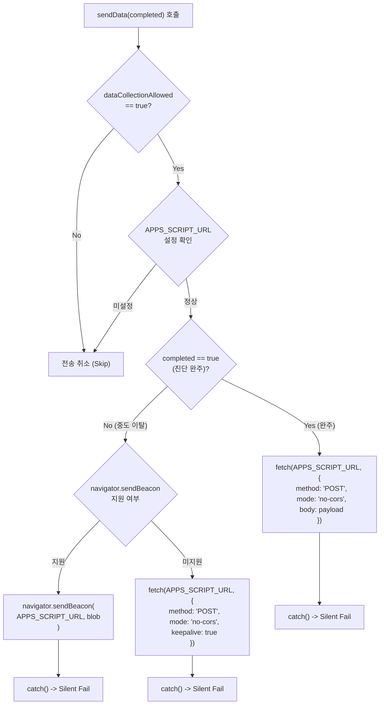

# ANALYSIS-03: 백엔드 연동 및 개인정보 보호 체계 분석

> **분석 대상 파일**: `index.html` (2,646줄), `quiz-data.js` (716줄)  
> **외부 참조 파일**: `apps-script.gs` (933줄 / 35KB, 서버측 백엔드 코드), `HANDOFF.md`  
> **작성일**: 2026-08-30  
> **작성자**: Antigravity  

---

## 1. 백엔드 연동 아키텍처 및 통신 개요

벨라리치 진단 시스템은 서버리스(Serverless) 아키텍처를 채택하고 있습니다. 프론트엔드는 GitHub Pages(`index.html`)에서 호스팅되며, 백엔드는 Google Apps Script Web App(`APPS_SCRIPT_URL`)으로 구성되어 Google Sheets에 데이터를 축적하고 이메일을 발송합니다.

* **엔드포인트 URL** (`index.html:1935`):
  ```javascript
  const APPS_SCRIPT_URL = 'https://script.google.com/macros/s/AKfycbzhUpGPuWJUssPk1F9hlvOwutqGy9w6Lo2fuygxdvDp4rCTRdteVvOk80ZDVgrDPNKX/exec';
  ```

---

## 2. 전송 Payload 필드 명세 (스펙 표)

`index.html:1977-2009`의 `buildPayload(completed)` 함수가 생성하는 JSON Payload의 전체 필드 목록입니다.

| 필드명 | 데이터 타입 | 필수 여부 | 예시 값 | 설명 및 소스 코드 위치 |
|---|---|:---:|---|---|
| `session_id` | String | 필수 | `"sid_lxa1b2_9k8j7"` | 세션 고유 식별자 (`sessionStorage` 기반, `index.html:1938-1946, 1991`) |
| `timestamp` | String (ISO 8601) | 필수 | `"2026-08-30T10:45:00.000Z"` | 데이터 전송 시점의 UTC 타임스탬프 (`index.html:1992`) |
| `completed` | Boolean | 필수 | `true` 또는 `false` | 진단 완주 여부 (`index.html:1993`) |
| `category` | String | 필수 | `"tax"` | 선택한 카테고리 ID (`index.html:1994`) |
| `group` | String | 필수 | `"tax"` | 구글 주소록 및 그룹 분류용 ID (`index.html:1995`) |
| `last_question` | Number | 필수 | `6` | 마지막 도달 질문 번호 (1~6, `index.html:1996`) |
| `time_taken_seconds` | Number | 필수 | `48` | 진단 시작부터 완료/이탈까지 소요된 시간(초) (`index.html:1997`) |
| `score` | Number \| null | 선택 | `75` | 100점 환산 점수 (미완료 이탈 시 `null`, `index.html:1998`) |
| `grade` | String \| null | 선택 | `"A"` | 진단 등급 S/A/B/C (미완료 이탈 시 `null`, `index.html:1999`) |
| `email` | String | 선택 | `"ceo@company.com"` | 사용자가 입력한 이메일 주소 (이탈 시 `""`, `index.html:2000`) |
| `newsletter_consent` | String | 필수 | `"yes"` 또는 `"no"` | 마케팅 뉴스레터 수신 동의 여부 (`index.html:2001`) |
| `q0_asset_size` | String | 필수 | `"10_to_30"` | 사전 질문(Q0) 자산 규모 (미선택 시 `"skip"`, `index.html:2002`) |
| `q1` | String | 선택 | `"비용 처리·법인 구조 최적화"` | 1번 문항 선택 옵션 레이블 (`index.html:1980-1989, 2003`) |
| `q2` | String | 선택 | `"검토 중 / 일부 활용"` | 2번 문항 선택 옵션 레이블 (`index.html:1980-1989, 2003`) |
| `q3` | String | 선택 | `"설립 검토 / 진행 중"` | 3번 문항 선택 옵션 레이블 (`index.html:1980-1989, 2003`) |
| `q4` | String | 선택 | `"분기 1회"` | 4번 문항 선택 옵션 레이블 (`index.html:1980-1989, 2003`) |
| `q5` | String | 선택 | `"분기 점검 + 사전 컨설팅"` | 5번 문항 선택 옵션 레이블 (`index.html:1980-1989, 2003`) |
| `q6` | String | 선택 | `"전략적 배당 + EXIT 설계"` | 6번 문항 선택 옵션 레이블 (`index.html:1980-1989, 2003`) |
| `user_agent` | String | 필수 | `"Mozilla/5.0 (Windows NT 10.0; ..."` | 접속 기기/브라우저 정보 앞 250자 (`index.html:2004`) |
| `screen_width` | Number | 필수 | `1920` | 브라우저 화면 너비 (`index.html:2005`) |
| `screen_height` | Number | 필수 | `1080` | 브라우저 화면 높이 (`index.html:2006`) |
| `referrer` | String | 필수 | `"https://blog.naver.com/..."` | 유입 경로 URL (없으면 `"direct"`, `index.html:2007`) |

---

## 3. 이중 전송 경로 (`fetch` vs `sendBeacon`) 비교 및 에러 핸들링

`index.html:2011-2046`의 `sendData(completed)` 함수는 전송 상황에 따라 두 가지 네트워크 전송 방식을 분기하여 사용합니다.



### 3.1 발동 조건 및 사용 이유

1. **경로 1: `fetch()` (`completed === true`, `index.html:2020-2026`)**:
   * **발동 시점**: 사용자가 문항을 모두 풀고 이메일 동의 폼을 제출하여 결과 화면(`#screen-result`)이 나타나는 순간 (`index.html:2406`).
   * **사용 이유**: 일반적인 비동기 POST 통신으로 완료 데이터를 전송하기에 가장 표준적이며 안정적입니다.
2. **경로 2: `navigator.sendBeacon()` (`completed === false`, `index.html:2028-2040`)**:
   * **발동 시점**: 사용자가 진단을 시작한 후 끝마치지 않고 브라우저 탭을 닫거나, 다른 앱으로 전환하거나, 뒤로가기를 누를 때 (`beforeunload`, `visibilitychange` 이벤트, `index.html:2049-2060`).
   * **사용 이유**: 브라우저 탭이 닫히는 언로드(Unload) 라이프사이클에서는 일반 `fetch()` 요청이 브라우저에 의해 즉시 강제 취소(Abort)됩니다. 반면 `navigator.sendBeacon()`은 브라우저 프로세스가 백그라운드에서 비동기 전송을 끝까지 보장하므로 중도 이탈률(Drop-off) 데이터를 유실 없이 수집할 수 있습니다. (미지원 구형 브라우저는 `keepalive: true` fetch 폴백).

### 3.2 실패 시 처리 및 무음 실패 (Silent Fail) 구조
* **CORS 및 Opaque Response**:
  * 프론트엔드는 Apps Script로 전송할 때 `mode: 'no-cors'`를 사용합니다 (`index.html:2023, 2035`). Google Apps Script의 리다이렉트 특성상 브라우저 보안 정책으로 인해 클라이언트는 HTTP 응답 코드나 본문을 읽을 수 없습니다(불투명 응답).
* **무음 실패 (Silent Fail)**:
  * `.catch(() => { /* silent fail — anonymous data isn't critical */ })` 구문(`index.html:2026, 2039, 2043-2045`)으로 인해 네트워크 오류, 서버 다운, 스크립트 실행 오류가 발생하더라도 **사용자 화면에는 아무런 에러 메시지나 경고창이 뜨지 않습니다.**
  * 장점: 사용자 진단 흐름과 결과 확인 경험이 방해받지 않음.
  * 단점: Apps Script 장애 발생 시 사용자는 진단이 완료된 줄 알지만 이메일은 오지 않는 "보이지 않는 장애"가 발생함.

---

## 4. 백엔드(Google Apps Script) 처리 로직 분석

*참조: `C:\Users\LG\Desktop\미니맥스\bellarich-test\apps-script.gs`*

### 4.1 시트 2곳 동시 저장 구조 (`apps-script.gs:85-116`)

1. **카테고리별 진단 시트 (`진단_<카테고리명>`)**:
   * 전송된 카테고리(`tax`, `realestate`, `succession`, `retirement`, `management`, `etc`)에 따라 해당 시트를 찾거나 없으면 자동 생성(`getOrCreateSheet`)합니다.
   * **v8 규격 22개 컬럼**으로 매핑되어 저장됩니다 (`apps-script.gs:59-83, 251-278`):
     * A: 타임스탬프 | B: 세션ID | C: 완료여부(YES/NO) | D: 마지막질문 | E: 소요시간(초) | F: 점수 | G: 등급 | H: 그룹 | I: 이메일 | J: 수집동의 | K: 뉴스레터동의 | **L: 자산규모(Q0)** | M: 브라우저 | N: 화면너비 | O: 화면높이 | P: 유입경로 | Q~V: Q1~Q6 답변
2. **구독자 통합 시트 (`구독자`)**:
   * 진단 완료(`completed === true`)이고 유효한 이메일(`@` 포함)이 존재할 경우 `appendToSubscribers()`(`apps-script.gs:107-115, 183-220`)를 호출합니다.
   * **10개 컬럼**으로 미러링됩니다:
     * A: 등록일 | B: 이메일 | C: 그룹 | D: 카테고리 | E: 등급 | F: 점수 | G: 수집동의 | H: 뉴스레터동의 | I: 세션ID | J: 메모('진단 완료')
   * **이메일 중복 체크**: 이미 등록된 이메일인 경우 중복 추가를 방지합니다 (`apps-script.gs:195-205`).

---

## 5. 결과 메일 및 PDF 발송 주체 검증

### 5.1 발송 주체 판정
* **클라이언트 (`index.html`)**: 메일 발송 API나 SMTP 연동, PDF 생성 라이브러리가 전혀 존재하지 않으며, 백엔드로 단순 JSON Payload만 전달합니다 (`index.html:2017-2026`).
* **백엔드 (`apps-script.gs`)**:
  * `doPost(e)` 내부에서 `trySendResultEmail(data)` 함수(`apps-script.gs:111, 454-484`)를 호출합니다.
  * Google Workspace의 `MailApp.sendEmail()` API를 직접 호출하여 사용자가 입력한 이메일 주소로 결과 리포트를 발송하는 **단독 발송 주체**입니다.

### 5.2 PDF 첨부 여부 (코드 근거)
* `apps-script.gs:471-478` 및 `HANDOFF.md:89` 확인 결과:
  ```javascript
  // v9: PDF 첨부 비활성화
  // if (pdfBlob) { opts.attachments = [pdfBlob]; ... }
  Logger.log('[메일 옵션] attachments=0 (PDF 비활성화, 메일 본문만)');
  MailApp.sendEmail(opts);
  ```
* **결론**: 과거 버전(v8 이전)에서는 PDF 첨부를 시도하였으나, Apps Script 내부 렌더링 한계 및 유료 PDF API 비용 거부(`HANDOFF.md:18, 89`)로 인해 **현재는 PDF를 첨부하지 않고, 고품질 반응형 HTML 이메일 본문만 발송**합니다.

---

## 6. 개인정보 수집 항목 및 법적 리스크 분석

### 6.1 수집 항목 현황

| 구분 | 수집 항목 | 목적 | 보유 기간 |
|---|---|---|---|
| **필수** | 이메일 주소 (`#consent-email`), Q1~Q6 문항 응답값, 진단 등급/점수, 세션ID | 진단 결과 보고서 발송, 통계 분석 | 발송 후 1년 (시트 데이터 12개월 자동 삭제) |
| **선택** | 뉴스레터 수신 동의 (`#consent-newsletter`), 자산 규모 (`#q0-section`) | 주 1회 자산관리 정보 발송, 영업 상담 프로파일링 | 24개월 또는 구독 취소 시까지 |
| **자동 수집** | User Agent, 화면 해상도, 리퍼러, 진단 소요시간 | 서비스 UX 개선 및 비정상 접근 방지 | 12개월 |

---

### 6.2 개인정보보호법 및 정보통신망법 관점의 리스크 지적

```
[⚠️ 고위험 모순 발생]
Intro 화면 (1626줄): "수집하지 않음: 이름, 이메일, 연락처, IP 주소..."
  VS
Consent 화면 (1769줄): "이메일 주소 *" (필수 입력 요구)
```

1. **[고위험] 인트로의 "이메일 미수집" 안내와 실제 필수 수집 간의 정면 충돌 (기만적 정보수집 리스크)**:
   * `index.html:1626`에서는 `"수집하지 않음: 이름, 이메일, 연락처, IP 주소"`라고 명시하여 사용자를 안심시켰으나, 진단 완료 직전 `index.html:1769`에서는 이메일을 필수(`required`)로 요구합니다.
   * 이는 개인정보보호법 제3조(개인정보 보호 원칙)의 신뢰 침해 및 표시광고법상 기만적 표시·광고로 해석될 소지가 매우 큽니다.
2. **[중위험] 개인정보 처리방침 전문(Privacy Policy) 및 법정 필수 고지사항 결여**:
   * `index.html:1777`의 체크박스 안내문(`수집 항목: 이메일 / 보유 기간: 1년 / 이용 목적: 진단 결과 발송`)은 간이 안내에 불과합니다.
   * 개인정보보호법 제30조에 따른 **개인정보 처리방침 전문 링크, 개인정보 보호책임자의 성명 및 연락처, 정보주체의 권리(열람/정정/삭제/처리정지 요구) 및 행사 방법, 파기 절차/방법**이 서비스 내에 전혀 게시되어 있지 않습니다.
3. **[중위험] 마케팅 목적 영리성 광고 수신 동의(선택) 법정 요건 미비**:
   * 정보통신망 이용촉진 및 정보보호 등에 관한 법률 제50조에 따라 광고성 정보를 전송하기 위해서는 **(1) 전송자의 명칭(벨라리치), (2) 수신동의 철회 방법, (3) 광고성 정보의 명시적 표기 방식**을 사전에 고지해야 하나, `index.html:1784-1786`은 단순 체크박스 형태로만 되어 있어 법적 요건 충족이 미흡합니다.
4. **[개선 권고안]**:
   * 인트로의 문구를 `"진단은 익명으로 진행되며, 결과 상세 보고서 수신을 원하실 경우 이메일 입력이 필요합니다"`로 정정.
   * 푸터 및 동의 화면에 정식 `[개인정보 처리방침]` 모달/페이지 링크 추가.
