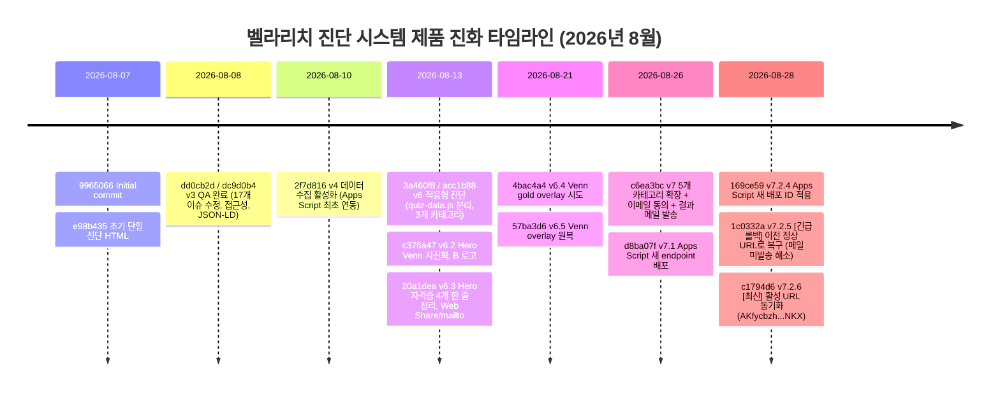

# ANALYSIS-04: 버전 이력 분석 및 제품 진화 해석

> **분석 대상 파일**: Git Repository Commit Logs (16 Commits), `index.html`, `quiz-data.js`  
> **외부 참조 파일**: `HANDOFF.md`, `restore-v6.5.ps1`, `apps-script.gs`  
> **작성일**: 2026-08-30  
> **작성자**: Antigravity  

---

## 1. 커밋 히스토리 타임라인 (전체 16개 커밋)

벨라리치 진단 시스템의 Git 저장소 커밋 이력을 시간순으로 정리한 타임라인입니다.



---

## 2. 버전별 진화 상세 내역

| 커밋 해시 | 버전/태그 | 작성 일시 | 주요 변경 및 기술적 의의 | 파일 변경 |
|---|---|---|---|---|
| `9965066` | Initial | 2026-08-07 22:22 | 저장소 생성 및 `README.md` 작성 | `README.md` |
| `e98b435` | v1 | 2026-08-07 22:23 | 초기 단일 10문항 진단지 HTML 업로드 | `index.html` (+804) |
| `dd0cb2d`<br>`dc9d0b4` | **v3** | 2026-08-08 17:46 | **QA 완료**: 등급 색상, 접근성(`aria-*`), Schema.org JSON-LD, SVG 파비콘 등 17개 이슈 수정 | `index.html` (+982, -335) |
| `2f7d816` | **v4** | 2026-08-10 11:19 | **데이터 수집 활성화**: Google Apps Script 웹앱 연동 (`buildPayload`, `sendData`, Q0 자산규모 추가) | `index.html` (+287, -3) |
| `3a460f8`<br>`acc1b88` | **v6** | 2026-08-13 00:10 | **적응형 진단 도입**: 3개 카테고리(`tax`, `realestate`, `succession`) 분기, `quiz-data.js` 데이터 분리 신설 | `index.html` (+647, -97)<br>`quiz-data.js` (+435) |
| `c376a47` | **v6.2** | 2026-08-13 00:53 | **Hero 개편**: Venn 다이어그램 이미지화(`venn-diagram.png`), B 로고, 자격증 텍스트 정리 | `index.html` (+27, -61)<br>`venn-diagram.png` 신설 |
| `20a1dea` | **v6.3** | 2026-08-13 01:36 | **공유 기능 강화**: 새 Venn 이미지 최적화, 자격증 4개 1열 정렬, Web Share API 및 `mailto:` 공유 지원 | `index.html` (+127, -49)<br>`venn-diagram.png` (46KB) |
| `4bac4a4` | **v6.4** | 2026-08-21 20:20 | Venn 교집합 영역에 골드 CSS overlay 효과 추가, data-notice / Q0 여백 조정 | `index.html` (+26, -7) |
| `57ba3d6` | **v6.5** | 2026-08-21 21:14 | **Venn overlay 원복**: 교집합 색 overlay 제거 및 단일 이미지로 롤백 (여백은 유지) | `index.html` (+5, -24) |
| `c6ea3bc` | **v7** | 2026-08-26 00:34 | **5개 카테고리 확장 & 리드 수집 구조 대전환**: 은퇴설계(`retirement`), 경영지원(`management`) 추가, `#screen-consent` 신설, **"결과는 메일로 발송"** 구조 도입 | `index.html` (+355, -21)<br>`quiz-data.js` (+285) |
| `d8ba07f` | **v7.1** | 2026-08-26 01:14 | Apps Script 백엔드 URL 변경 (새 엔드포인트 배포) | `index.html` (URL 변경) |
| `169ce59` | **v7.2.4** | 2026-08-28 22:36 | Apps Script URL 변경 (신규 배포 ID 연결) | `index.html` (URL 변경) |
| `1c0332a` | **v7.2.5** | 2026-08-28 23:04 | **[긴급 롤백]**: 이전 정상 Apps Script URL로 롤백 (*"메일 안 오던 문제 해소"*) | `index.html` (URL 롤백) |
| `c1794d6` | **v7.2.6** | 2026-08-28 23:37 | **[현재 최신]**: 활성 URL 최종 동기화 (`AKfycbzh...NKX`) | `index.html` (URL 동기화) |

---

## 3. 주요 설계 변화 및 제품 진화 방향 해석

### 3.1 `v6.5`: Venn 교집합 색 Overlay 시도 및 원복 사유
* **배경 (`v6.4`, `4bac4a4`)**:
  * 3-in-1 융합 모델(부동산+법인+자산관리)의 핵심인 '교집합(벨라리치)'을 시각적으로 강조하기 위해 CSS 절대 위치(`position: absolute`)로 골드 하이라이트 오버레이를 얹었습니다.
* **원복 사유 (`v6.5`, `57ba3d6`)**:
  1. **반응형 뷰포트 왜곡**: 모바일 및 다양한 기기 해상도(`max-width: 480px`, 태블릿 등)에서 원본 이미지의 크기 변화에 오버레이 박스의 좌표와 크기가 정확히 일치하지 않고 어긋나는 현상 발생.
  2. **시각적 완성도 저하**: 래스터 이미지(`venn-diagram.png`) 위에 반투명 CSS 레이어를 겹치면서 텍스트 가독성이 떨어지고 테두리가 부자연스럽게 번짐.
  3. **판단**: CSS 오버레이를 걷어내고 정밀 보정된 단일 이미지(`venn-diagram.png`)를 그대로 사용하는 것이 브라우저 간 호환성과 시각적 안정성 측면에서 우월하다고 판단하여 원복함.

---

### 3.2 `v7`: 5개 카테고리 확장과 "결과는 메일로" 전환의 의미

`v7` 커밋(`c6ea3bc`)은 본 프로젝트의 가장 결정적인 **비즈니스 전환점**입니다.

```
[v6 이하: 단순 진단 도구]
질문 응답 ──> [화면에 모든 분석/솔루션 즉시 노출] ──> 사용자가 이메일 남길 이유 없음 (리드 전환율 극저)

[v7: B2B 리드 생성 머신 (Lead Magnet)]
질문 응답 ──> [이메일 입력 & 동의 필수] ──> [화면: 등급/점수만 노출, 상세 리포트는 이메일로 발송] ──> 고품질 CEO 이메일 DB 확보!
```

#### 설계 변경의 핵심 의미
1. **카테고리 확장 (3개 → 5개)**:
   * 기존(절세, 부동산, 승계)에서 CEO들의 실제 주요 관심사인 **'은퇴설계(개인 자산/연금)'** 와 **'경영지원(자금조달/IR/조직/노무)'** 을 추가하여 기업 생애주기 전반을 포괄하도록 확장.
2. **리드 획득(전환율) 극대화**:
   * v6까지는 화면에서 모든 솔루션을 보여주었기 때문에 사용자가 익명으로 결과를 소비하고 이탈했습니다.
   * v7에서는 결과 화면에서 `findings-card`와 `cta-card`를 강제로 숨기고(`index.html:2395-2398`), `"자세한 결과는 입력하신 이메일로 보내드렸어요"`라는 메일 발송 알림(`index.html:1811-1817`)을 전면에 배치하여 **진성 잠재고객(CEO)의 이메일 수집을 강제하는 구조**로 성공적으로 전환했습니다.

---

### 3.3 `v7.1 → v7.2.4 → v7.2.5(롤백) → v7.2.6`: Apps Script 장애 원인 및 재발 방지책

2026년 8월 28일 밤 22:36부터 23:37까지 약 1시간 동안 Apps Script URL이 4번 변경되고 1번의 롤백이 발생했습니다. 커밋 메시지에 *"메일 안 오던 문제 해소"* 가 명시되어 있습니다.

#### A. 장애 원인 심층 가설
1. **Apps Script 웹앱 배포 시 권한 승인(OAuth) 누락**:
   * Google Apps Script는 신규 배포(New Deployment)를 생성하거나 코드에 새 서비스(`MailApp`, `PropertiesService` 등)가 추가될 때마다 개발자 계정으로 **OAuth 권한 재승인(Authorize Access)** 을 거쳐야 합니다.
   * `v7.2.4` 배포 시 코드만 배포하고 권한 승인을 완료하지 않아, 백엔드에서 `MailApp.sendEmail()`이 권한 에러(Permission Denied)로 실행 중단되었을 가능성이 가장 높습니다.
2. **배포 접근 권한(Who has access) 설정 오류**:
   * 웹앱 배포 시 접근 권한을 "Anyone(모든 사용자)"이 아닌 "Only myself"로 잘못 설정하여 외부 사용자의 POST 요청이 401/403으로 차단되었을 가능성.
3. **무음 실패(Silent Fail)로 인한 지연 발견**:
   * 프론트엔드가 `mode: 'no-cors'`로 전송하여 에러가 발생해도 콘솔에만 찍히고 화면은 정상 동작하므로, 실제 메일함을 열어보고서야 메일이 오지 않는 장애를 뒤늦게 인지함.
   * 이에 따라 즉시 직전의 검증된 정상 URL로 롤백(`v7.2.5`)하여 장애를 해결한 뒤, 새 배포 권한을 완벽히 부여한 최신 배포 ID(`v7.2.6`, `AKfycbzh...NKX`)로 최종 동기화함.

#### B. 재발 방지책 (Action Items)

```
[Apps Script 무중단 배포 표준 프로세스]
1. URL 고정 방식 채택: "새 배포" 금지 -> 기존 배포의 '버전 관리(Edit -> New Version)' 사용
2. 배포 체크리스트 준수: Execute as = Me / Who has access = Anyone / OAuth 승인 완료 확인
3. 자동 헬스체크 도입: 배포 직후 GET/POST 테스트 웹훅 실행 검증
```

1. **URL 불변성 유지 (In-place Deployment)**:
   * 배포 시마다 새 URL을 생성하지 말고, Google Apps Script의 **[배포 관리] -> [수정] -> [새 버전]** 방식을 사용하여 프론트엔드의 `APPS_SCRIPT_URL`을 매번 수정하지 않도록 고정합니다.
2. **배포 전 체크리스트 의무화**:
   * `Execute as: Me(내 계정)` 설정 확인.
   * `Who has access: Anyone(모든 사용자)` 설정 확인.
   * 스크립트 에디터에서 `doPost` 또는 `trySendResultEmail`을 테스트 실행하여 OAuth 팝업 승인 완료 확인.
3. **E2E 테스트 절차 수립**:
   * 배포 후 개발자 본인의 테스트 이메일(`kimjoon0528@naver.com`)로 1회 진단을 완주하여 (1) Google Sheets 기록, (2) 이메일 수신, (3) 구독자 시트 저장을 확인한 후에만 실운영에 반영합니다.
